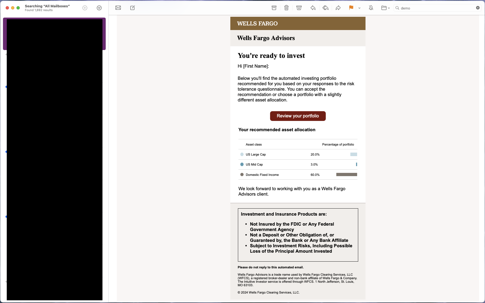
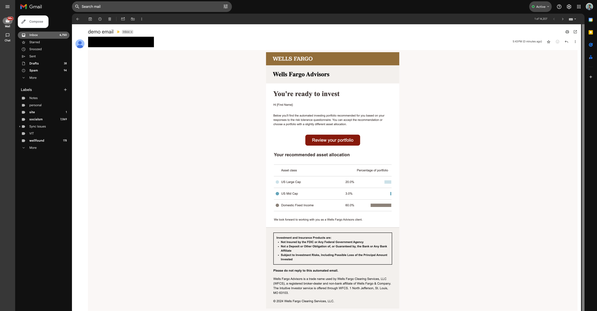
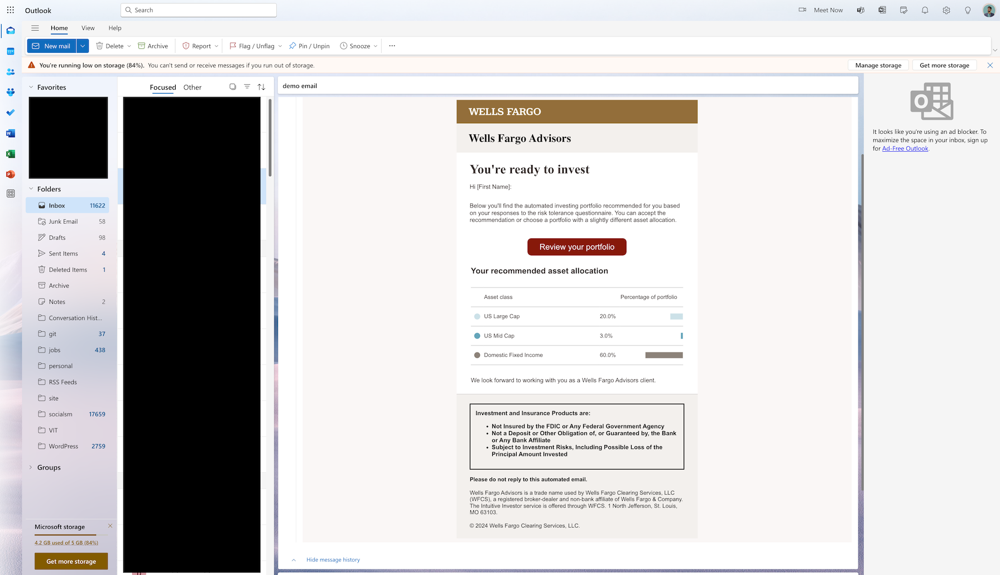
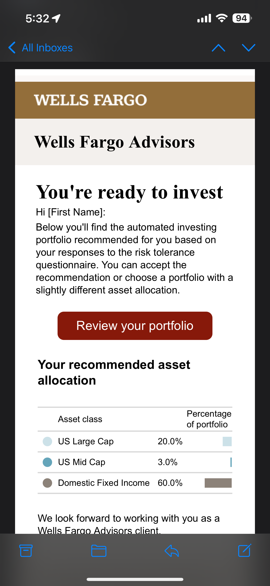
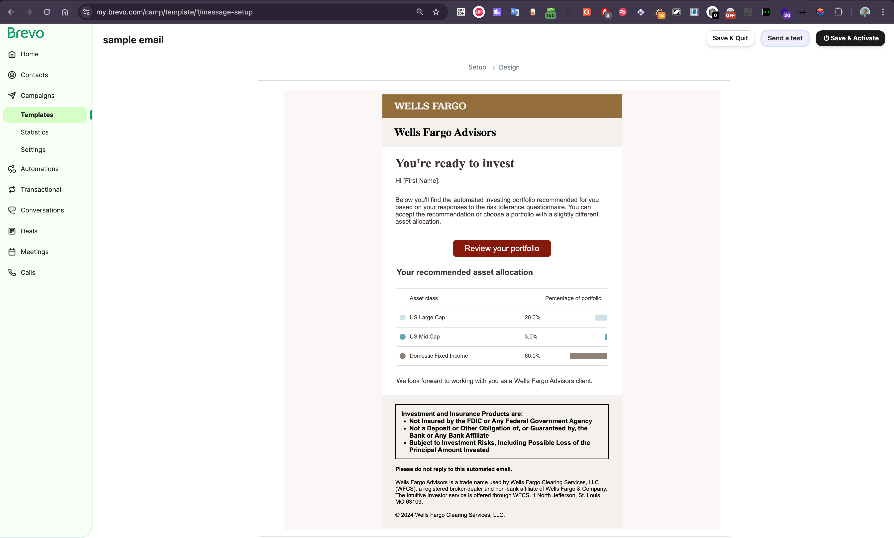
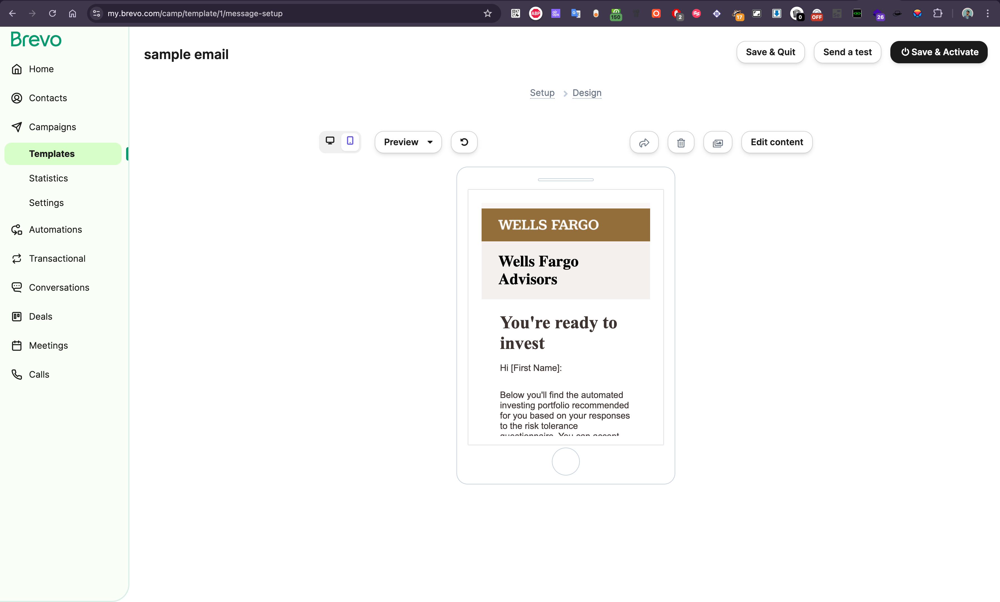

# Assignment: Responsive Email Template Development

# SigFig-Assignment

## Tools used

- VS Code Editor
- Browser Developer Tools
- [Brevo](https://www.brevo.com) platform for testing the email template.

## Technologies used

- HTML
- CSS

## Challenges faced

- Email clients do not support external stylesheets, so I had to use inline styles.
- Email clients do not support `:hover` pseudo class effect, so I had to use javascript to add hover effect to the button. [email clients do not support it also]
- Email clients do not support `@media` queries, so I had to use table structure to make the email template responsive.
- Faced the challenge to add mokup graphs in email and align it to right, So i created a simple graph using `p` tag and styled them using inline styles.

## Thought process

- I started by creating a simple layout with a header, body, and footer using a table structure. I used a table structure because it is the most reliable way to create a responsive email template.
- Then added some basic styles i.e. `background colour`, `padding`, `margin` to the layout.
- I have saved the media i.e. `logo` icons in the `assets/images` folder and linked them to the template. [used WebP format, WebP lossless images are 26% smaller in size compared to PNGs that makes the images load faster]
- Then added the content, and formated it using inline styles acording to the design.
- I have added button hover effect using js because it is not possible to add `:hover` pseudo class effect using inline styles. [email clients do not support it]
- I have tested the email template on different email clients and devices. The template is rendering correctly on all the email clients and devices. see the screenshots below.

## Steps for testing the email template

- Open the `inline-email.html` file.
- Copy the content of the file and paste it in the email template of the email client. [I have used Brevo platform for testing the email template]
- Send the email to the desired email address.

## Test Images

- I have included test images in the `doc` folder to verify the rendering of images in the email template.
- Below are the test images used:

##### Apple Mail - Desktop

##### Gmail - Desktop

##### Outlook - Desktop

##### Apple Mail - Mobile

##### Gmail - Mobile

- These images help in ensuring that the email template displays correctly across different email clients and devices.
- Email is sent and tested from [Brevo](https://www.brevo.com) platform.

##### Brevo

